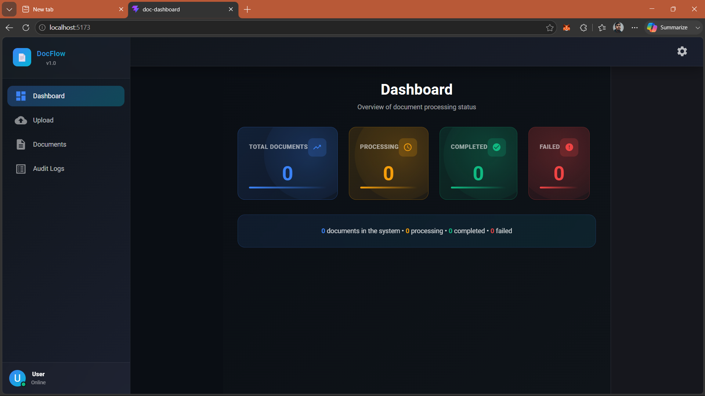
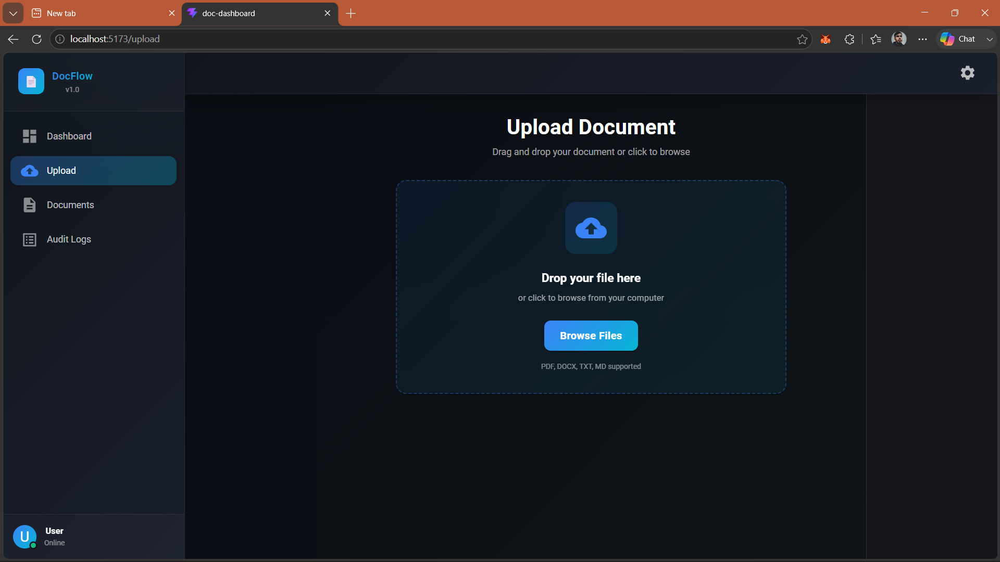
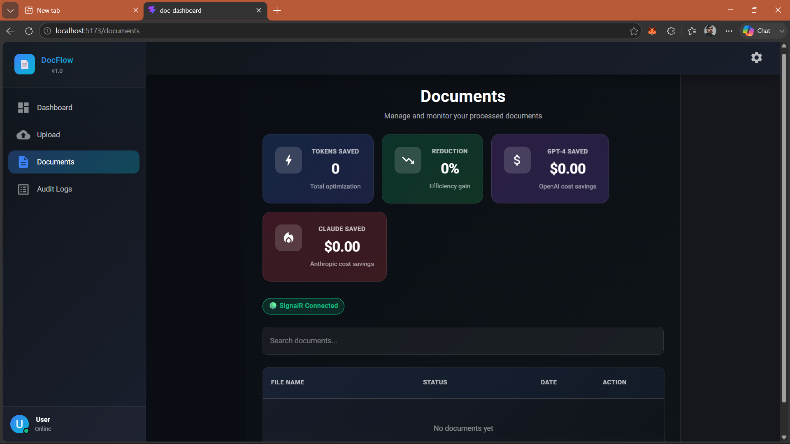
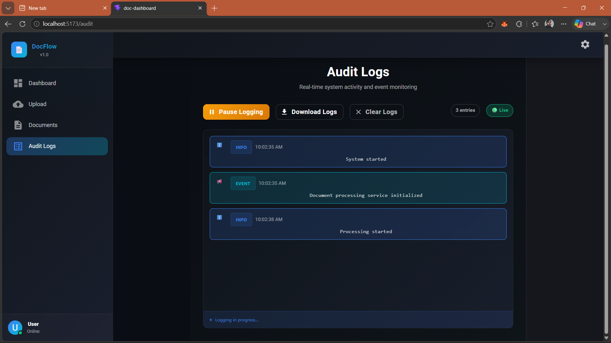

# 📄 Doc Processing System (AI-Optimized Markdown Converter)

A microservices-based document processing system that converts files (PDF, DOCX, TXT, etc.) into **clean, structured Markdown**, optimized for **LLM usage, token efficiency, and cost reduction**.

---

## 🖥️ Demo

---
## 🚀 Features

### 🔹 Document Conversion
- PDF → Markdown
- DOCX, XLSX, PPTX → Markdown (via Pandoc)
- TXT, CSV, HTML → Markdown

---

### 🔹 AI Optimization
- Removes unnecessary words
- Cleans noisy text
- Improves readability for LLMs

---

### 🔹 Token Analytics
- Original Tokens
- Cleaned Tokens
- Tokens Saved
- Reduction %

---

### 🔹 💰 Cost Saving (LLM-based)
- GPT Cost Saving Calculation
- Claude Cost Saving Calculation
- Helps reduce AI processing cost

---

### 🔹 Microservices Architecture
- ProcessingService → Document conversion
- AuditService → Logging & tracking
- DocumentService → Core API handling
- Kafka → Event-driven communication

---

### 🔹 Docker Support
- Containerized services
- Easy setup with Docker Compose
- Consistent environment across machines

---

## 🏗️ System Architecture
Frontend → DocumentService → ProcessingService → Kafka → AuditService

---

## 🧰 Technologies Used

- .NET (ASP.NET Core)
- Docker & Docker Compose
- Kafka (Event Streaming)
- Pandoc (Document Conversion)
- pdftotext (PDF Processing)
- Regex-based AI Compression

---

## ⚙️ How It Works

1. User uploads document
2. Request goes to DocumentService
3. ProcessingService converts document to Markdown
4. AI compression reduces unnecessary tokens
5. Token & cost analysis is calculated
6. Kafka sends event to AuditService
7. Final result is returned to user

---

## 🧪 Example Output

